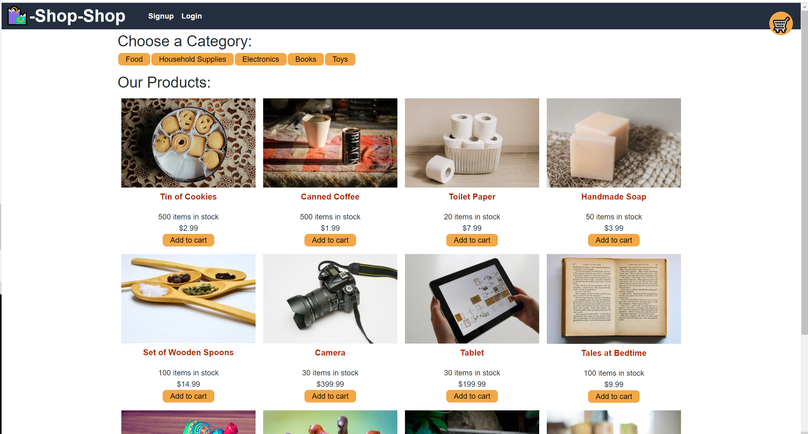

# shop-shop

# Table of Contents
1) [Description](#Description)
2) [Usage](#Usage)
3) [Installation](#Installation)
4) [Contributions](#Contributions)
5) [Licenses](#Licenses)
6) [Tests](#Tests)
7) [Questions](#Questions)

## Description
A site to shop for various items.

## Usage
Reworked from starter code to use Redux.

## Installation
Clone repo to local machine, install dependencies.

Live site at https://fierce-river-98954.herokuapp.com/

## Contributions
n/a

## Licenses

## Tests
n/a

## Screenshot

## Questions

### GitHub Profile
Dzarbis(http://github.com/Dzarbis)

### Email
dzarbis@gmail.com